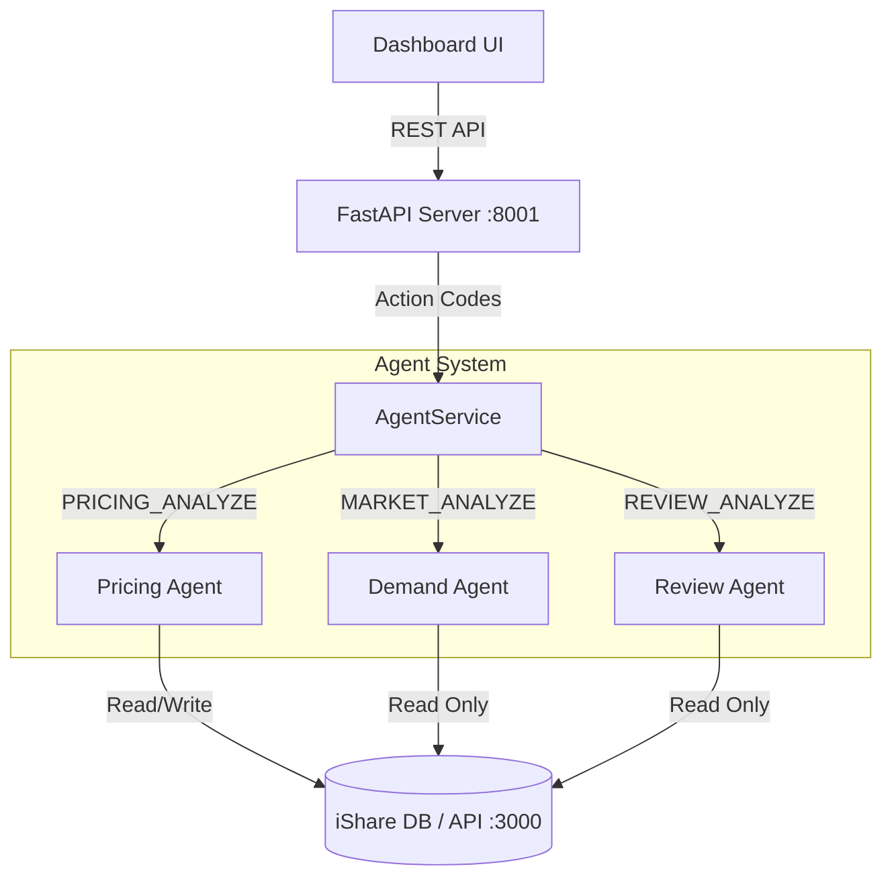

# iShare Dashboard Agent


An intelligent multi-agent system designed to power the iShare Host Dashboard. This system analyzes listing performance, market trends, and review sentiment to provide actionable insights for hosts.

## 🧠 Core Features

The system consists of three specialized sub-agents orchestrated by a central API service:

### 1. Pricing Agent (`PricingAgent`)
- **Goal**: Optimize listing prices to maximize revenue.
- **Logic**: Analyzes current occupancy, recent booking velocity, and demand levels.
- **Context**: Specialized for Malaysia Market (2026 Calendar).
- **Features**:
  - Detects Public Holidays (New Year, Federal Territory Day, etc.).
  - Calculates dynamic price adjustments (+5% to +20%).
  - **Actionable**: Can write price updates directly to the database.

### 2. Market Trend Agent (`DemandTrendAgent`)
- **Goal**: Help owners understand their market position.
- **Logic**: Compares owner portfolio against market-wide top performers.
- **Features**:
  - Identifies trending categories (Accommodation, Items, Transport).
  - Generates specific recommendations based on portfolio gaps.
  - "On Track" validation for well-performing assets.

### 3. Review Analysis Agent (`ReviewAnalysisAgent`)
- **Goal**: Summarize guest sentiment and identify improvement areas.
- **Logic**: NLP analysis of recent reviews.
- **Features**:
  - Sentiment breakdown (Positive/Neutral/Negative).
  - Recurring theme extraction (Cleanliness, WiFi, Location).
  - Actionable improvement recommendations.

---

## 🏗 System Architecture



---

## 🚀 Getting Started

### Prerequisites
- **Python 3.10+**
- **iShare Backend** running on `localhost:3000` (NestJS)

### Installation

1. **Clone the repository**
   ```bash
   git clone https://github.com/your-repo/dashboard-agent.git
   cd DashboardAgent
   ```

2. **Set up Virtual Environment**
   ```bash
   python -m venv .venv
   source .venv/bin/activate
   pip install -r requirements.txt
   ```

3. **Configure Environment**
   Create a `.env` file (if not exists):
   ```env
   API_BASE_URL=http://localhost:3000
   ```

### Running the System

Start the integration API server:

```bash
# Make sure your virtual env is active
source .venv/bin/activate

# Run the server
uvicorn my_agent2.api.endpoints:app --reload --port 8001
```

The API will be available at: **http://localhost:8001**

---

## 🔌 API Integration

For full API documentation, endpoints, and code examples, please refer to:
👉 **[API / UI Integration Guide](my_agent2/api/README.md)**

### Quick Reference: Action Codes

| Card Name | Action Code | Method | Endpoint |
|-----------|-------------|--------|----------|
| Pricing Card | `PRICING_ANALYZE` | POST | `/pricing/analyze` |
| Take Action | `PRICING_APPLY` | POST | `/pricing/apply` |
| Market Trends | `MARKET_ANALYZE` | POST | `/market/analyze` |
| Low Rating Alert | `REVIEW_ANALYZE` | POST | `/review/analyze` |

---

## 🧪 Testing

We provide a test script to verify all agents and database connections are working correctly.

```bash
# Run quick smoke test
python my_agent2/api/test_api.py --quick

# Run full diagnostic suite
python my_agent2/api/test_api.py
```

---

## 📁 Project Structure

```
my_agent2/
├── api/                 # REST API & Integration Layer
│   ├── endpoints.py     # FastAPI Routes
│   ├── action_codes.py  # Action Code Definitions
│   ├── agent_service.py # Agent Orchestration
│   └── README.md        # API Documentation
├── database/            # Database Connectivity
├── sub_agents/          # Agent Logic
│   ├── pricing_agent.py
│   ├── demand_agent.py
│   └── review_agent.py
└── deployment/          # Deployment Scripts
```
